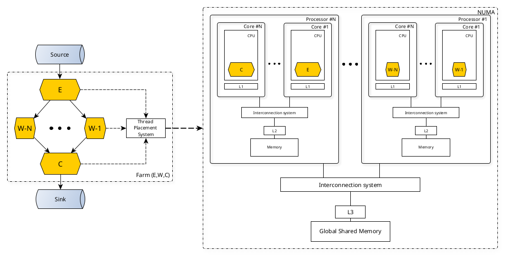

# About

Our goal is to use visualization techniques to quickly see the performance impact of different mapping strategies applied to parallel stream processing applications executed on multicore architectures.

# What is mapping?

## Research questions

- How to view metrics of the same stream processing application executed with mapping strategies?
- How to compare performance of CPU cores?
- Which were the most "expensive" functions?

#### Example of different settings

Click [here](src/applications/simple-test/analysis/plot-data.ipynb) to see an example of how different mapping strategies impact the performance of parallel stream processing applications.

## Possible problems

#### Large amount of data

Example of an application:

- Execution time: 145272 ms
- `perf.data` size: 439.102 MB

#### `perf` returns raw metrics

- No CPU utilization;
- No memory utilization;
